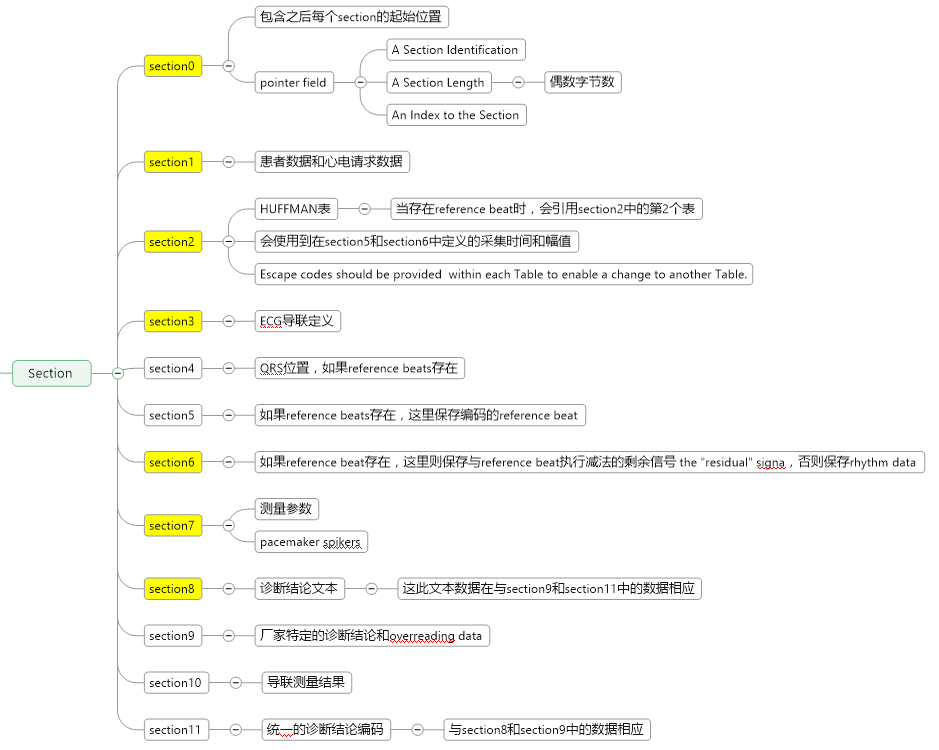

[TOC]

# SCP-ECG格式说明

1. 对于所有有符号的二进制值，应采用2的补码。

2. 小端字节序

3. The term "Rhythm Data" is used to indicate the ECG recording over the entire recording time, usually 10-seconds in most recorders.

4. 每个section偶数字节补齐，只在每个section结尾进行补齐，使用NULL进行补齐

5. 默认字符集为 Latin-1 (ISO-8859-1) 

SCP-ECG文档中描述存在4种类别实现，区别在于包含的数据存在差异，如下图：
第1种只包含患者信息，测量参数，诊断结论，
第2种额外包含了波形数据，
第3种额外包含了平均模板数据，
第4种额外包含波形数据和平均模板数据。

其中最大的难点在于平均模板数据，SCP-ECG的最大优势是实现了心电数据的压缩，通过平均模板数据作为参考数据，再将每个QRS波的数据减去这个参考数据，然后进行Huffman编码，从而减少编码数据量。

## 整体结构定义

- 2个字节的CRC
- 4字节总文件长度
- Section区域

### 每个Section由数据头和数据部分组成

- 16字节 Section ID Header
- Section Data Part

## Section0

## Section1

## Section2

## Section3

## Section4

## Section5

## Section6

## Section7

## Section8

## Section9
厂家特定的诊断结论和overreading data

## Section10

## Section11

# 例子文件解析

## Section0~4

## Section0

## Section6

## Section7

